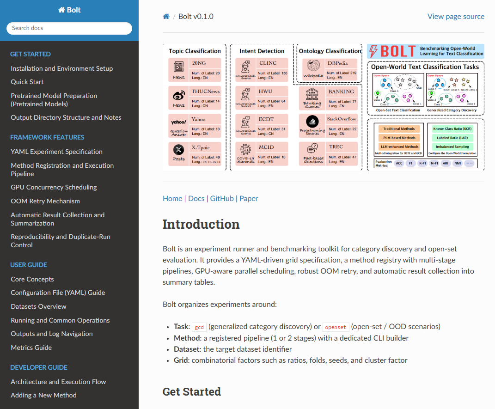
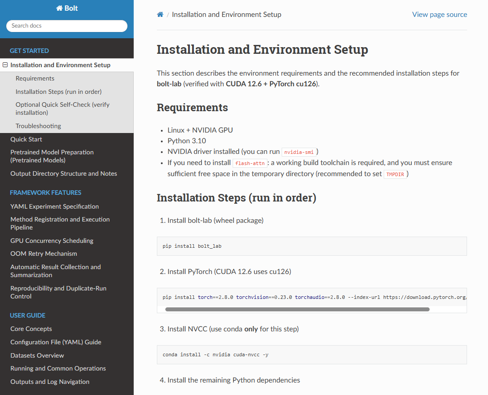
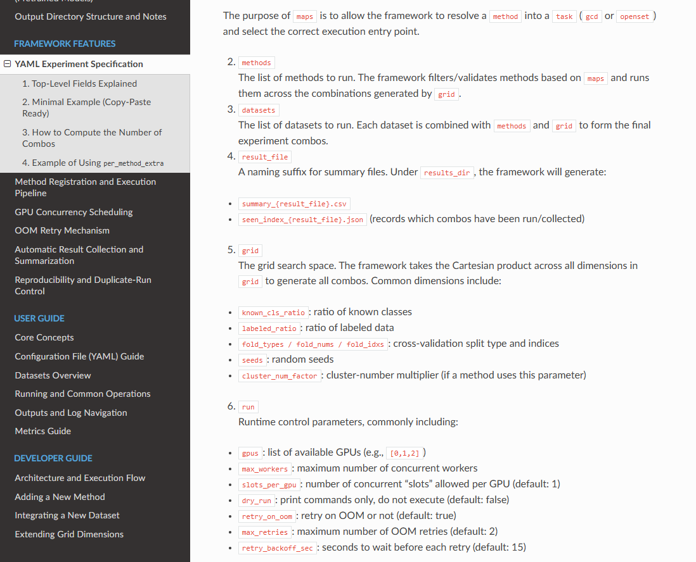
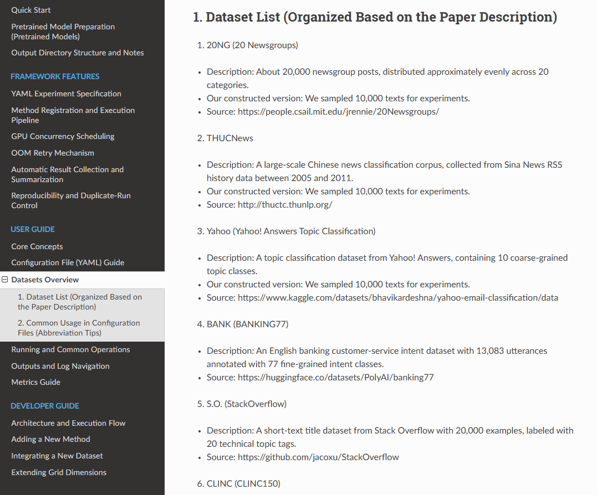

# BOLT: Benchmarking Open-world Learning for Text Classification

**BOLT** is a comprehensive benchmark designed to evaluate open-world learning (OWL) for text classification. It supports two major tasks:

- **Generalized Category Discovery (GCD):** Automatically discovering new categories while learning from partially labeled known classes.
- **Open-set Text Classification (Open-set TC):** Identifying whether a text sample belongs to a known class or should be rejected as unknown.

This repository provides standardized datasets, splits, evaluation protocols, and implementations to facilitate rigorous and reproducible research in open-world text classification.

---

## 📁 Project Structure
```
BOLT/
├── code/                      # Source code for experiments
│   ├── gcd/                  # Implementation for GCD task
│   └── openset/              # Implementation for Open-set TC task
│
├── data/                     # Processed datasets and data scripts
│   ├── banking/              # Banking77 dataset
│   ├── clinc/                # CLINC150 dataset
│   ├── ele/                  # E-commerce intent classification dataset
│   ├── hwu/                  # HWU64 dataset
│   ├── mcid/                 # MCID multilingual intent dataset
│   ├── news/                 # News classification dataset
│   ├── stackoverflow/        # StackOverflow question classification dataset
│   ├── thucnews/             # THUCNews Chinese news classification dataset
│   ├── data_statics.json     # Dataset statistics (in JSON format)
│   ├── data_statics.xlsx     # Dataset statistics (in Excel format)
│   ├── step0-process.ipynb   # Notebook for data cleaning and preprocessing
│   ├── step1-data_split.ipynb# Notebook for label splitting and fold generation (Fold-5 and Fold-10)
│   └── step2-data_statics.ipynb # Notebook for computing dataset statistics (class counts, distribution, etc.)
│
├── pretrained_models/        # Pretrained model links (symbolic links)
│   ├── bert-base-chinese             -> /ssd/models/tiansz/bert-base-chinese
│   ├── bert-base-uncased             -> /ssd/models/AI-ModelScope/bert-base-uncased
│   └── Meta-Llama-3.1-8B-Instruct    -> /ssd/models/LLM-Research/Meta-Llama-3___1-8B-Instruct
│
├── README.md                 # This project description file
```

---

## 📦 Data Format

### Label Splits

- Stored under `label/`, each dataset includes label subsets based on **Known Class Ratio (KCR)**.
- `fold5/` and `fold10/`: Class labels are evenly split into 5 or 10 folds. Each fold is used as known classes in turn; the rest are treated as unknown.

### Labeled Data

- Stored under `labeled_data/`, each file corresponds to a **Labeled Ratio (LR)** setting.
- Each entry includes:
  - `label`: the class label.
  - `labeled`: whether the sample is labeled (`True`) or unlabeled (`False`).
  - (Note: `text` field is omitted for efficiency.)

### Raw Data

- `origin_data/` contains raw text datasets before processing.
- Processing and statistical scripts are provided as Jupyter notebooks.

---

## 🚀 Getting Started

1. Clone the repository:

```bash
git clone https://github.com/yourusername/BOLT.git
cd BOLT

conda create -n bolt python=3.10
conda activate bolt
pip install -r requirements.txt
```

2.	(Optional) Create a conda environment and install dependencies:

```bash
conda create -n bolt python=3.10
conda activate bolt
pip install -r requirements.txt
```

3.	Run experiments under code/gcd/ or code/openset/.

4.	Use notebooks in data/ for dataset preparation and statistics.


## 📚 Documentation

The rendered documentation is already included in this repository.

### Quick access
- **Rendered HTML (recommended):** `docs/build/html/index.html`
- **Sphinx sources (if needed):** `docs/source/`

### How to read
- Open `docs/build/html/index.html` as the entry page and navigate via the sidebar / table of contents.
- If you prefer reading source files directly on GitHub, start from `docs/source/index.*` and follow the TOC links.


### 📸 Documentation Preview

> The following screenshots show four representative documentation pages.

|  |  |
|---|---|
|  |  |
|  |  |
